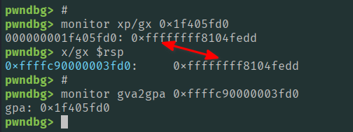

## 1. Introduction — The Problem

In this article, we will go through the virtual-to-physical memory translation; the focus will be on x86_64 four-level paging. In our testing environment we have a virtual machine running Linux OS and inside it there is a QEMU that runs another Linux kernel. The QEMU is configured to allow GDB to attach to it and give us full kernel debugging capabilities. So, without further ado, let's get started.

Try running the following command on any Linux system:

```sh
cat /proc/self/maps
```

You will see output similar to:

```sh
563661f99000-563661f9b000 r--p 00000000 fd:00 2229745                    /usr/bin/cat
563661f9b000-563661f9f000 r-xp 00002000 fd:00 2229745                    /usr/bin/cat
563661f9f000-563661fa1000 r--p 00006000 fd:00 2229745                    /usr/bin/cat
```

Notice that every address starts and ends with `000`, why is that?  And what are these addresses anyway? Are they actual locations in RAM? Why are memory regions aligned this way, and how does the CPU know where the data really resides?

Answering these questions requires understanding how memory addressing works. In this article, we focus only on x86_64.

---


## 2. Computer Architecture Recap

Before discussing virtual memory, here is a brief recap: at a high level, a computer consists of a CPU, memory, storage devices, and peripheral hardware connected through system buses.

```
                             ┌──────────────────────────┐
┌────────┐                   │           CPU            │
│ Memory │◄──┐               │  ┌──────────┬─────────┐  │
└────────┘   │  ┌──────────┐ │  │Registers │   CU    │  │
             ├─►│  Bridge  │◄├─►│  L1 Cache│   ALU   │  │
┌────────┐   │  └──────────┘ │  ├──────────┴─────────┤  │
│  Disk  │◄──┤               │  │       L2 Cache     │  │
└────────┘   │               │  └────────────────────┘  │
             │               └──────────────────────────┘
┌──────────┐ │
│ Network  │◄┘
└──────────┘
```

The CPU reads data from memory, performs some instructions, and writes results back to memory. While registers and CPU caches provide very fast storage, they are limited in size. That is why most of a program's code and data resides in RAM.

Random Access Memory (RAM) is the component that matters most for us now. It provides a large, byte-addressable storage space where operating systems, applications, stacks, heaps, and shared libraries are kept while they are in use. Understanding how the CPU addresses RAM is the first step toward understanding why the addresses shown in `/proc/self/maps` look the way they do.

---


## 3. Physical Memory

Physical memory is the RAM installed in your computer. It can be viewed as a large array of bytes, where every byte has a unique physical address. On x86_64 systems, the width of a physical address is determined by the processor's **MAXPHYADDR** value. Unlike virtual addresses, physical addresses are not always 64 bits wide. Many consumer CPUs support 39-bit physical addresses, server processors often support 46 bits, and recent hardware can support up to 52 bits.

Since the number of address bits determines the size of the address space, we get:

```
0x0000000000000000..............0x0000007fffffffff   (39-bit: 512 GB)
0x0000000000000000..............0x00003fffffffffff   (46-bit:  64 TB)
0x0000000000000000..............0x000fffffffffffff   (52-bit:   4 PB)
```

On our testing machine, we can find the physical address bits it supports by running the following command:

```sh
grep "address sizes" /proc/cpuinfo | head -1
address sizes   : 39 bits physical, 48 bits virtual
```

We see that it is 39 bits, which means `2^39 = 512 GB` of addressable physical space.

Another thing to note: we can check the physical address space map itself by running this command. Here the output is trimmed to System RAM entries only.

```sh
sudo cat /proc/iomem
00001000-0009fbff : System RAM          ← 624 KB conventional memory
00100000-dffeffff : System RAM          ← main block (~3.5 GB)
100000000-21fffffff : System RAM        ← continues above 4 GB (~4 GB more)
  1f2000000-1f3002731 : Kernel code
  1f3200000-1f3cbdfff : Kernel rodata
  1f3e00000-1f424c67f : Kernel data
  1f45ac000-1f57fffff : Kernel bss
```

What we notice is that the RAM is not necessarily one large contiguous block.

Also notice that the kernel itself occupies a fixed region of physical memory. Its code, read-only data, writable data, and BSS are all located at specific physical addresses within one of the RAM ranges, and these addresses are the *real* hardware addresses used by the memory controller when accessing RAM.

When KASLR is disabled (`nokaslr` boot parameter), that region always starts at the address set by `CONFIG_PHYSICAL_START`, which defaults to `0x1000000` (16 MB). We can verify this inside the QEMU guest:

```sh
cat /proc/config.gz | zcat | grep CONFIG_PHYSICAL_START
CONFIG_PHYSICAL_START=0x1000000
```

The corresponding virtual address is derived using `__START_KERNEL_map`, a compile-time constant defined in the Linux kernel source (`arch/x86/include/asm/page_64_types.h`) that marks the base of the virtual address region reserved for the kernel image. On x86_64 its value is `0xffffffff80000000`:

```
#define __START_KERNEL_map	_AC(0xffffffff80000000, UL)

Kernel_text_virtual_addr = __START_KERNEL_map  +  CONFIG_PHYSICAL_START
                         = 0xffffffff80000000  +  0x1000000 = 0xffffffff81000000
```

So with KASLR off, the kernel text always starts at virtual address `0xffffffff81000000` and physical address `0x1000000` — every boot, on every run.

---


## 4. Virtual Memory — Why Does It Exist?

Virtual memory exists to solve problems that physical memory alone cannot address. It provides three core properties:

- **Isolation**: process `A` cannot read or write process `B`'s memory
- **Address space**: every process can start at address `0x0` without conflicting
- **Flexibility**: contiguous virtual pages can map to non-contiguous physical pages

The key idea is that virtual memory gives each process its own independent view of memory:

```
Physical Memory (shared by whole system)
0x0000000000000000......................0x000fffffffffffff
    ▲              ▲              ▲              ▲
    │              │              │              │
┌─────────┐  ┌─────────┐  ┌─────────┐  ┌─────────┐
│   P1    │  │   P2    │  │   P3    │  │   P4    │
│0x000... │  │0x000... │  │0x000... │  │0x000... │
│  ...    │  │  ...    │  │  ...    │  │  ...    │
│0x7ff... │  │0x7ff... │  │0x7ff... │  │0x7ff... │
└─────────┘  └─────────┘  └─────────┘  └─────────┘
Virtual memory (each process sees its own)
```

The OS kernel, in collaboration with the CPU hardware, maintains mappings between each process's virtual addresses and the physical addresses they correspond to.

**Virtual memory is dedicated to your process. Physical memory is shared across the whole system.**

### What is inside a process's virtual memory space?

A process does not see physical RAM directly. Instead, it sees a structured **virtual address space** composed of multiple regions with different roles and permissions. Let's run the following command on our Linux testing machine:

```sh
cat /proc/self/maps
563661f99000-563661f9b000 r--p 00000000 fd:00 2229745                    /usr/bin/cat
563661f9b000-563661f9f000 r-xp 00002000 fd:00 2229745                    /usr/bin/cat
563661f9f000-563661fa1000 r--p 00006000 fd:00 2229745                    /usr/bin/cat
563661fa1000-563661fa2000 r--p 00007000 fd:00 2229745                    /usr/bin/cat
563661fa2000-563661fa3000 rw-p 00008000 fd:00 2229745                    /usr/bin/cat
563662fe3000-563663004000 rw-p 00000000 00:00 0                          [heap]
7fb5f7810000-7fb5f7832000 rw-p 00000000 00:00 0
7fb5f7832000-7fb5f7b1b000 r--p 00000000 fd:00 2229144                    /usr/lib/locale/locale-archive
7fb5f7b1b000-7fb5f7b1e000 rw-p 00000000 00:00 0
7fb5f7b1e000-7fb5f7b46000 r--p 00000000 fd:00 2248663                    /usr/lib/x86_64-linux-gnu/libc.so.6
7fb5f7b46000-7fb5f7cdb000 r-xp 00028000 fd:00 2248663                    /usr/lib/x86_64-linux-gnu/libc.so.6
7fb5f7cdb000-7fb5f7d33000 r--p 001bd000 fd:00 2248663                    /usr/lib/x86_64-linux-gnu/libc.so.6
7fb5f7d33000-7fb5f7d34000 ---p 00215000 fd:00 2248663                    /usr/lib/x86_64-linux-gnu/libc.so.6
7fb5f7d34000-7fb5f7d38000 r--p 00215000 fd:00 2248663                    /usr/lib/x86_64-linux-gnu/libc.so.6
7fb5f7d38000-7fb5f7d3a000 rw-p 00219000 fd:00 2248663                    /usr/lib/x86_64-linux-gnu/libc.so.6
7fb5f7d3a000-7fb5f7d47000 rw-p 00000000 00:00 0
7fb5f7d50000-7fb5f7d52000 rw-p 00000000 00:00 0
7fb5f7d52000-7fb5f7d54000 r--p 00000000 fd:00 2238320                    /usr/lib/x86_64-linux-gnu/ld-linux-x86-64.so.2
7fb5f7d54000-7fb5f7d7e000 r-xp 00002000 fd:00 2238320                    /usr/lib/x86_64-linux-gnu/ld-linux-x86-64.so.2
7fb5f7d7e000-7fb5f7d89000 r--p 0002c000 fd:00 2238320                    /usr/lib/x86_64-linux-gnu/ld-linux-x86-64.so.2
7fb5f7d8a000-7fb5f7d8c000 r--p 00037000 fd:00 2238320                    /usr/lib/x86_64-linux-gnu/ld-linux-x86-64.so.2
7fb5f7d8c000-7fb5f7d8e000 rw-p 00039000 fd:00 2238320                    /usr/lib/x86_64-linux-gnu/ld-linux-x86-64.so.2
7ffca337b000-7ffca339c000 rw-p 00000000 00:00 0                          [stack]
7ffca33c9000-7ffca33cd000 r--p 00000000 00:00 0                          [vvar]
7ffca33cd000-7ffca33cf000 r-xp 00000000 00:00 0                          [vdso]
ffffffffff600000-ffffffffff601000 --xp 00000000 00:00 0                  [vsyscall]

```

Each line of the output describes a **virtual memory region** and it follows this format:

```
<start>-<end>  <perms>  <file offset>  <dev>  <inode>  <name>
```

The permission field encodes access rules:

- `r` = readable
- `w` = writable
- `x` = executable
- `p` = private mapping (copy-on-write)

Notice that there are a heap, a stack, shared libraries (libc), and many others — each occupying its own address range with distinct permissions. For example, the heap at address `563662fe3000` is `rw-` (data, not executable), the libc code at `7fb5f7b46000` is `r-x` (executable, not writable), and the stack at `7ffca337b000` is `rw-` (data, not executable). Again, all these addresses are virtual addresses and this view is specific to this `cat` process; a different binary would show different addresses and may load different libraries.

---


## 5. Pages — The Unit of Translation

Translating every individual byte from virtual to physical would require a mapping entry per byte, which is far too expensive in memory and time. Instead, the OS and CPU work in fixed-size chunks called **pages**.

On x86_64:

- A page is **4096 bytes (4 KB = 0x1000 bytes)**
- Every page start address is a multiple of `0x1000`; this means the lowest 12 bits of any page-aligned address are always zero
  - Valid page start addresses: 0x0000, 0x1000, 0x2000, 0x3000, ...
  - Invalid page start addresses: 0x1500  (not 0x1000-aligned)

This is also why entries in `/proc/self/maps` always begin and end on page boundaries: memory mappings are always allocated in page-sized units.

A **virtual page** is mapped to a **physical page**. This mapping is handled by hardware (the MMU) using page tables maintained by the kernel. This mapping allows that:

- contiguous virtual pages do not need to map to contiguous physical memory
- multiple virtual pages (even from different processes) can map to the same physical page (for example shared libraries)

On our testing machine, we can check the size of a page by running this command.

```sh
getconf PAGE_SIZE
4096
```

---


## 6. Evolution of the Page Table Structure

The CPU must keep track of how virtual pages map to physical page frames. This mapping is stored in a data structure called the **page table**, maintained by the operating system and accessed by the hardware during every memory translation.

### Single Page Table (naive)

This is the simplest design: we have only one flat table of 512 entries, where each entry holds the physical address of one page. So the size of a table is `512 * 8 bytes = 4096 bytes` and we have 512 pages; each page is 4 KB, which means the address space is `512 * 4 KB = 2 MB`. Two issues here: `2 MB` is too small for a process, and a single flat table cannot handle non-contiguous virtual memory.

```
Page Table
┌─────┬────────────┐
│ 000 │ 0xba106000 │
│ 001 │ 0x541f0000 │
│ 002 │ 0x4f654000 │
│ ... │ ...        │
│ 511 │ 0xfd255000 │
└─────┴────────────┘
```


### Add a Page Directory (two levels — 1 GB)

In order to scale further, the **Page Directory** (PD) was introduced. It has 512 entries; each entry points to a separate Page Table, not to a page itself. That means the virtual address space can be calculated as:

```sh
512 * 512 * 4 KB = 1 GB
```

Entries marked NONE cost nothing — unused Page Tables are simply not allocated. This is how non-contiguous virtual memory is supported efficiently.

```
Page Directory
┌─────┬────────┐
│ 000 │ PT A   │──┐   Page Table A
│ 001 │ NONE   │  └──►┌─────┬──────────┐
│ 002 │ PT B   │──┐   │ 000 │0xba106000│
│ 003 │ NONE   │  │   │ 001 │0x541f0000│
│ ... │ ...    │  │   │ 511 │0x4f654000│
│ 511 │ NONE   │  │   └─────┴──────────┘
└─────┴────────┘  │
                  │   Page Table B
                  └──►┌─────┬──────────┐
                      │ 000 │0xfd255000│
                      │ ... │          │
                      │ 511 │0xbb315000│
                      └─────┴──────────┘
```


### Add PDPT (three levels — 512 GB)

To scale further, another level is added. A **Page Directory Pointer Table** (PDPT) with 512 entries, each pointing to a PD. Now the virtual address space is larger:

```sh
512 × 512 × 512 × 4 KB = 512 GB
```


### Add PML4 (four levels — 256 TB)

The final level added to x86_64 is the Page Map Level 4 (PML4), with 512 entries each pointing to a PDPT. This brings the virtual address space to:
```sh
512 × 512 × 512 × 512 × 4 KB = 256 TB
```

This four-level structure is what modern x86_64 systems use and will be the focus of this article.

```
One Page Table Level (4096 bytes = 1 page)
┌─────────────────────────────┐
│ Entry 0     (8 bytes)       │  ◄── index 0
├─────────────────────────────┤
│ Entry 1     (8 bytes)       │  ◄── index 1
├─────────────────────────────┤
│ Entry 2     (8 bytes)       │  ◄── index 2
├─────────────────────────────┤
│ ...                         │
├─────────────────────────────┤
│ Entry 511   (8 bytes)       │  ◄── index 511
└─────────────────────────────┘
    512 × 8 = 4096 bytes = 0x1000 = 1 page
```

---


## 7. The 48-bit Virtual Address

Although x86_64 uses 64-bit registers, only 48 bits are currently used for virtual addressing in the standard 4-level paging model. The remaining upper bits are not arbitrary: they must replicate bit 47. If this rule is violated, the CPU triggers a fault. This constraint is known as **canonical addressing**.

### Structure of a 48-bit virtual address

A 48-bit virtual address is split into 5 parts: 4 are used as page-table indices and one as the page offset:

```
┌─────────┬─────────┬─────────┬─────────┬──────────────┐
│  9 bits │  9 bits │  9 bits │  9 bits │   12 bits    │
│  PML4   │  PDPT   │   PD    │   PT    │    offset    │
└─────────┴─────────┴─────────┴─────────┴──────────────┘
◄──────────────── 48 bits total (9+9+9+9+12) ──────────►
```

We mentioned before that at each level there are 512 entries, so the 9-bit group selects one of 512 entries at that level (2^9 = 512). The final 12 bits are the byte offset within the physical page (2^12 = 4096 = one page). So if we try to picture how the virtual address is related to the different memory levels, we come up with something like this:

```
Virtual Address (48 bits)
┌────────┬────────┬────────┬────────┬────────────────┐
│  [47-39]  [38-30]  [29-21]  [20-12]     [11-0]     │
│  PML4idx  PDPTidx   PDidx    PTidx       offset    │
└────┬───┴────┬───┴────┬───┴────┬───┴────────────────┘
     │        │        │        │
     ▼        │        │        │
┌─────────┐   │        │        │
│  PML4   │   │        │        │      Level 4
│ (512    │   │        │        │
│ entries)│   │        │        │
└────┬────┘   │        │        │
     │        ▼        │        │
     │   ┌─────────┐   │        │
     └──►│  PDPT   │   │        │      Level 3
         │ (512    │   │        │
         │ entries)│   │        │
         └────┬────┘   │        │
              │        ▼        │
              │   ┌─────────┐   │
              └──►│   PD    │   │      Level 2
                  │ (512    │   │
                  │ entries)│   │
                  └────┬────┘   │
                       │        ▼
                       │   ┌─────────┐
                       └──►│   PT    │      Level 1
                           │ (512    │
                           │ entries)│
                           └────┬────┘
                                │
                                ▼
                         ┌─────────────┐
                         │ Physical    │
                         │ Page (4 KB) │
                         └─────────────┘
```

In the diagram we see that the PML4 level is indexed using virtual address bits 47–39, the PDPT level using bits 38–30, the PD using bits 29–21, and finally the PT level using bits 20–12. Let's see that in action.

#### Finding Indices

Let's take an address `0x55ef00152000` — how can we extract the indices of each level?

For level 4, to extract the bits of PML4idx we shift the address right by 39 bits and then apply a bitwise AND with 0x1FF (which has 9 ones) — that zeros out all bits except those of PML4idx.

```sh
PML4idx = (0x55ef00152000 >> 39) & 0x1FF = 0xab = 171
# 0x55ef00152000                = 10101011110111100000000000101010010000000000000
# 0x55ef00152000 >> 39          = 10101011
# 0x55ef00152000 >> 39 & 0x1FF  = 10101011 & 111111111 = 10101011 = 0xab = 171
```

We can do the same to extract the indices of the other levels.

```sh
PDPTidx = (0x55ef00152000 >> 30) & 0x1FF = 0x1bc = 444
PDidx   = (0x55ef00152000 >> 21) & 0x1FF = 0x0   = 0
PTidx   = (0x55ef00152000 >> 12) & 0x1FF = 0x152 = 338
```

Once the physical page is found, the final 12-bit offset is added to reach the exact byte inside that page.

```sh
offset = 0x55ef00152000 & 0xFFF = 0x0 = 0 # FFF is 12 ones

final physical address = PT_base_addr[PTidx] + offset
```

Each index selects an entry for its corresponding level of the page table hierarchy:

```
PML4[171] → PDPT[444] → PD[0] → PT[338] → physical page
```

Because the offset is zero here, the address points to the start of a page.

This is the exact mechanism the CPU uses during a page table walk on every memory access.

We can use Python to do the same conversion:

```sh
python3 -c "
addr = 0x55ef00152000
print(f'PML4 index : {(addr >> 39) & 0x1ff}  (bits 47-39)')
print(f'PDPT index : {(addr >> 30) & 0x1ff}  (bits 38-30)')
print(f'PD   index : {(addr >> 21) & 0x1ff}  (bits 29-21)')
print(f'PT   index : {(addr >> 12) & 0x1ff}  (bits 20-12)')
print(f'offset     : 0x{addr & 0xfff:x}        (bits 11-0)')
"
PML4 index : 171  (bits 47-39)
PDPT index : 444  (bits 38-30)
PD   index : 0    (bits 29-21)
PT   index : 338  (bits 20-12)
offset     : 0x0  (bits 11-0)
```

---


## 8. Inside a Page Table Entry (64 bits)

Now let's go a little bit deeper into the entries. We know now that each entry at every level is **8 bytes (64 bits)**. Since each table has 512 entries:

```
512 × 8 bytes = 4096 bytes = 0x1000 = exactly one page
```

The 64 bits of one entry are split into several parts:

- Bits 0-7: control bits used by hardware to define page properties such as read/write, access, etc.
- Bits 8-11: ignored by hardware and available to the OS
- Bits 12-51: it stores the physical address of the next level
- Bits 52-62: ignored (available to the OS)
- Bit 63: **NX** (No-Execute) — if set, no code can execute from any page reachable through this entry

```
63  62     52 51                  12 11          0
┌───┬─────────┬──────────────────────┬─────────────┐
│NX │ ignored │  physical address    │ control bits│
│   │ (52-62) │  of next-level table │ (P, R/W...) │
└───┴─────────┴──────────────────────┴─────────────┘
```

This structure is almost the same across all levels with some differences. The following sections show the meaning of each bit based on the level it belongs to.

### PML4

```
PML4                                                            Present ──────┐
                                                            Read/Write ──────┐|
                                                      User/Supervisor ──────┐||
                                                  Page Write Through ──────┐|||
                                               Page Cache Disabled ──────┐ ||||
                                                         Accessed ──────┐| ||||
                                                         Ignored ──────┐|| ||||
                                                       Reserved ──────┐||| ||||
┌─ NX          ┌─ Ignored                              Ignored ──┬──┐ |||| ||||
|┌───────────┐ |┌──────────────────────────────────────────────┐ |  | |||| ||||
||  Ignored  | ||               PDPT Physical Address          | |  | |||| ||||
||           | ||                                              | |  | |||| ||||
XXXX XXXX XXXX 0XXX XXXX XXXX XXXX XXXX XXXX XXXX XXXX XXXX XXXX XXXX 0XXX XXXX
       56        48        40        32        24        16         8         0
```


| Bits  | Field                         | Meaning                                                                                               |
| ----- | ----------------------------- | ----------------------------------------------------------------------------------------------------- |
| 0     | **P** (Present)               | Entry is valid. If 0, CPU raises #PF on access                                                        |
| 1     | **R/W**                       | 0 = read-only, 1 = writable (enforced in user mode)                                                   |
| 2     | **U/S** (User/Supervisor)     | 0 = kernel-only, 1 = user-space accessible                                                            |
| 3     | **PWT** (Page Write Through)  | Write-through vs write-back caching for the PDPT table itself                                         |
| 4     | **PCD** (Page Cache Disabled) | Bypasses CPU cache when accessing the PDPT table                                                      |
| 5     | **A** (Accessed)              | Set by hardware on any read or write through this entry; OS uses it to track which entries are in use |
| 6     | Ignored                       | Available to OS                                                                                       |
| 7     | Reserved                      | Must be 0                                                                                             |
| 8–11  | Ignored                       | Available to OS                                                                                       |
| 12–51 | **PDPT Physical Address**     | Physical base address of the next-level PDPT table (lower 12 bits always 0, not stored)               |
| 52–62 | Ignored                       | Available to OS                                                                                       |
| 63    | **NX** (No-Execute)           | If 1, no code can execute from any page reachable through this entry                                  |


### PDPT

```
PDPT                                                            Present ──────┐
                                                            Read/Write ──────┐|
                                                      User/Supervisor ──────┐||
                                                  Page Write Through ──────┐|||
                                               Page Cache Disabled ──────┐ ||||
                                                         Accessed ──────┐| ||||
                                                         Ignored ──────┐|| ||||
                                                      Page Size ──────┐||| ||||
┌─ NX          ┌─ Ignored                              Ignored ──┬──┐ |||| ||||
|┌───────────┐ |┌──────────────────────────────────────────────┐ |  | |||| ||||
||  Ignored  | ||               PD Physical Address            | |  | |||| ||||
||           | ||                                              | |  | |||| ||||
XXXX XXXX XXXX 0XXX XXXX XXXX XXXX XXXX XXXX XXXX XXXX XXXX XXXX XXXX 0XXX XXXX
       56        48        40        32        24        16         8         0
```

Bits 0–6, 8–11, 12–51, 52–62, 63: same as PML4.


| Bits | Field              | Meaning                                                                                                                                                                |
| ---- | ------------------ | ---------------------------------------------------------------------------------------------------------------------------------------------------------------------- |
| 7    | **PS** (Page Size) | **0** = this entry points to a PD table (normal walk continues). **1** = this entry maps a **1 GB huge page** directly — the walk stops here, no PD or PT is consulted |


### PD

```
PD                                                              Present ──────┐
                                                            Read/Write ──────┐|
                                                      User/Supervisor ──────┐||
                                                  Page Write Through ──────┐|||
                                               Page Cache Disabled ──────┐ ||||
                                                         Accessed ──────┐| ||||
                                                         Ignored ──────┐|| ||||
                                                      Page Size ──────┐||| ||||
┌─ NX          ┌─ Ignored                              Ignored ──┬──┐ |||| ||||
|┌───────────┐ |┌──────────────────────────────────────────────┐ |  | |||| ||||
||  Ignored  | ||                PT Physical Address           | |  | |||| ||||
||           | ||                                              | |  | |||| ||||
XXXX XXXX XXXX 0XXX XXXX XXXX XXXX XXXX XXXX XXXX XXXX XXXX XXXX XXXX 0XXX XXXX
       56        48        40        32        24        16         8         0
```

Bits 0–6, 8–11, 12–51, 52–62, 63: same as PML4.


| Bits | Field              | Meaning                                                                                                                                                          |
| ---- | ------------------ | ---------------------------------------------------------------------------------------------------------------------------------------------------------------- |
| 7    | **PS** (Page Size) | **0** = this entry points to a PT table (normal walk continues). **1** = this entry maps a **2 MB huge page** directly — the walk stops here, no PT is consulted |


### PT

```
PT                                                              Present ──────┐
                                                            Read/Write ──────┐|
                                                      User/Supervisor ──────┐||
                                                  Page Write Through ──────┐|||
                                               Page Cache Disabled ──────┐ ||||
                                                         Accessed ──────┐| ||||
┌─── NX                                                    Dirty ──────┐|| ||||
|┌───┬─ Memory Protection Key              Page Attribute Table ──────┐||| ||||
||   |┌──────┬─── Ignored                               Global ─────┐ |||| ||||
||   ||      | ┌─── Reserved                          Ignored ───┬─┐| |||| ||||
||   ||      | |┌──────────────────────────────────────────────┐ | || |||| ||||
||   ||      | ||            4KB Page Physical Address         | | || |||| ||||
||   ||      | ||                                              | | || |||| ||||
XXXX XXXX XXXX 0XXX XXXX XXXX XXXX XXXX XXXX XXXX XXXX XXXX XXXX XXXX XXXX XXXX
       56        48        40        32        24        16         8         0
```

Bits 0–5, 63: same as PML4. The PT entry has several unique bits because it describes an actual data page, not just a pointer to another table.


| Bits  | Field                          | Meaning                                                                                                                                                                                  |
| ----- | ------------------------------ | ---------------------------------------------------------------------------------------------------------------------------------------------------------------------------------------- |
| 6     | **D** (Dirty)                  | Set by hardware on the first write to the page. Cleared by OS (e.g. before evicting the page to disk — if D=0 the page is clean and can be discarded without writing back)               |
| 7     | **PAT** (Page Attribute Table) | Combined with PWT (bit 3) and PCD (bit 4) to select one of 8 memory-type entries from the `IA32_PAT` MSR (e.g. WB, WC, UC)                                                               |
| 8     | **G** (Global)                 | If 1, this TLB entry is **not** flushed when CR3 is reloaded. Used for kernel pages that are present in every process's address space, avoiding redundant TLB misses on context switches |
| 9–11  | Ignored                        | Available to OS                                                                                                                                                                          |
| 12–51 | **4 KB Page Physical Address** | Physical base address of the mapped data page                                                                                                                                            |
| 52–58 | Ignored                        | Available to OS                                                                                                                                                                          |
| 59–62 | **Protection Key**             | Selects one of 16 user-space protection domains (PKU feature). Allows per-domain read/write restrictions without modifying page table entries                                            |

> **Note on huge pages:** The PDPT and PD diagrams above show the common case where the **PS (Page Size) bit = 0**, meaning the entry points to the next-level table and the walk continues normally. When PS = 1 the entry skips the remaining levels and maps a large block of physical memory directly: a PDPT entry with PS=1 maps a **1 GB page** (bits 51–30 hold the base address, bits 29–13 are reserved), and a PD entry with PS=1 maps a **2 MB page** (bits 51–21 hold the base address, bits 20–13 are reserved). The PT level has no PS bit — it always maps a 4 KB page.

---


## 9. Process Isolation via CR3

As we know, on a running Linux machine there could be many running processes; however, each process maintains its own **PML4** which means every process has its own complete mapping from virtual addresses to physical memory. No two processes share the same active PML4 during execution. But how is that possible?

Actually, the CPU stores the physical address of current process's PML4 in a special control register called **CR3**:

```
CR3 register ──► physical address of PML4
PML4 entry   ──► physical address of PDPT
PDPT entry   ──► physical address of PD
PD entry     ──► physical address of PT
PT entry     ──► physical address of final page
```

CR3 is only accessible in **ring 0** (kernel mode). User-space processes cannot modify it. When the OS switches from one process to another, it loads the new process's PML4 address into CR3 — instantly switching the entire virtual address space. This is the hardware mechanism that enforces isolation.

The hardware walks these four levels automatically on every memory access via the **MMU** (Memory Management Unit).

> To avoid repeating the same walk for hot addresses, resolved translations are cached in the **TLB** (Translation Lookaside Buffer). Writing a new value to CR3 flushes all non-global TLB entries, which is why context switches have a small performance cost.

---


## 10. Practical Example

It's time to put what we have learned so far into a practical example. In our environment, GDB is attached to a Linux kernel running inside a QEMU emulator. Because execution is in ring 0, GDB has full access to control registers including CR3. The goal of this section is to manually walk all four page table levels for a live kernel address and verify the result against what the hardware computed.

We start by reading CR3:

```sh
gdb-multiarch ~/course/kernel/vmlinux -ex "target remote :1234"
...
...
 RBP  0xffffc90000003fe8 —▸ 0xffffffff82803d98 (init_thread_union+15768) —▸ 0xffffffff82803da9 (init_thread_union+15785) ◂— 0xffffffff828121
 RSP  0xffffc90000003fd0 —▸ 0xffffffff8104fedd (__sysvec_apic_timer_interrupt+45) ◂— nop
...
...
pwndbg> p/x $cr3
$1 = 0x280b004

```

CR3 holds the physical address of PML4, but as established in §8, the lowest 12 bits are control bits, not part of the address. We mask them off to get the PML4 base physical address:

```sh
CR3 = 0x280b004

bit position:  51 ............. 12  11 ......... 0
               ┌────────────────────┬─────────────┐
               │   PML4 address     │ control bits│
               │   0x280b           │   0x004     │
               └────────────────────┴─────────────┘
                        ▲                  ▲
               address already        12 bits of
               at the right           noise to remove
               bit positions
```


```sh
PML4_base_phy_addr = 0x280b004 & ~0xfff = 0x280b000
```

Now we have the base physical address `0x280b000` of PML4. We also know that it has 512 entries. However, most of the entries are empty; only entries corresponding to virtual address ranges are mapped.

From the GDB output, we will translate the RSP register value 0xffffc90000003fd0 to its physical address. We know that this virtual address is split into parts, so first we start by calculating the indices as we did before:

```
Virtual Address (48 bits)
┌────────┬────────┬────────┬────────┬────────────────┐
│  [47-39]  [38-30]  [29-21]  [20-12]     [11-0]     │
│  PML4idx  PDPTidx   PDidx    PTidx       offset    │
└────┬───┴────┬───┴────┬───┴────┬───┴────────────────┘

addr = 0xffffc90000003fd0
PML4idx = (addr >> 39) & 0x1ff   = 0x192 = 402
PDPTidx = (addr >> 30) & 0x1ff   = 0x0   = 0
PDidx   = (addr >> 21) & 0x1ff   = 0x0   = 0
PTidx   = (addr >> 12) & 0x1ff   = 0x3   = 3
offset  =  addr        & 0xfff   = 0xfd0
```

### Level 4 — PML4
We have the PML4 base address and its index we can use them to obtain the address of the PML4 entry that points to PDPT

```
pml4_entry_addr = PML4 base addr + (PML4idx * 8)
pml4_entry_addr = 0x280b000 + (402 * 8) = 0x280bc90
```

Using GDB, we can read the address stored at pml4_entry_addr.

```
pwndbg> monitor xp/gx 0x280bc90
000000000280bc90: 0x0000000003000067
```

Masking off the lower 12 bits gives us the PDPT base address

```
PDPT_phy_addr = 0x0000000003000067 & ~0xfff = 0x3000000
```

### Level 3 — PDPT
Following the same logic, we can calculate the entry address inside PDPT:

```
pdpt_entry_addr = PDPT base addr + (PDPTidx * 8)
pdpt_entry_addr = 0x3000000 + (0 * 8) = 0x3000000
```

Reading physical memory at that address

```
pwndbg> monitor xp/gx 0x3000000
0000000003000000: 0x00000000030f7067
```

Stripping the control bits reveals the PD base address.

```
PD_phy_addr = 0x00000000030f7067 & ~0xfff = 0x30f7000
```

### Level 2 — PD
The entry address inside PD is:

```
pd_entry_addr = PD base addr + (PDidx * 8)
pd_entry_addr = 0x30f7000 + (0 * 8) = 0x30f7000
```

GDB reads the value stored there.

```
pwndbg> monitor xp/gx 0x30f7000
00000000030f7000: 0x00000000030f8067
```

Applying the same mask gives us the PT base address.

```
PT_phy_addr = 0x00000000030f8067 & ~0xfff = 0x30f8000
```

### Level 1 — PT
Finally, the entry address inside PT is:

```
pt_entry_addr = PT base addr + (PTidx * 8)
pt_entry_addr = 0x30f8000 + (3 * 8) = 0x30f8018
```

Reading that last entry.

```
pwndbg> monitor xp/gx 0x30f8018
00000000030f8018: 0x800000001f405163

```

The PT entry is the last level — it gives us the **actual physical page**, not another table. We need to extract only bits 12 to 51

```
base_physical_page = value at pt_entry_addr & 0x000FFFFFFFFFF000
base_physical_page = 0x800000001f405163 & 0x000FFFFFFFFFF000 = 0x1f405000
```

Before moving on, notice that the raw entry `0x800000001f405163` has bit 63 set — the leading `8` in hex is `1000` in binary, so bit 63 = **1**. From §8's PT table, bit 63 is the **NX (No-Execute)** bit. This page cannot execute code, which makes complete sense: we translated the kernel stack address (RSP), and a stack should never be executable.

Now we need to add the offset to get the physical address:

```sh
physical_address = base_physical_page + offset
                 = 0x1f405000     + 0xfd0 = 0x1f405fd0

```

### Verification
Using GDB, we can read the address stored there.

```sh
pwndbg> monitor xp/gx 0x1f405fd0
000000001f405fd0: 0xffffffff8104fedd
```

Now let's verify our work in GDB by reading the value in RSP

```sh
pwndbg> x/gx $rsp
0xffffc90000003fd0:     0xffffffff8104fedd
```

Both reads return identical value `0xffffffff8104fedd`.




As another test, we can use this command to convert our target virtual address directly to its physical address.

```sh
pwndbg> monitor gva2gpa 0xffffc90000003fd0
gpa: 0x1f405fd0 # the same physical_address
```

Observe that it is the same as the calculated one.

So the full translation is confirmed.

```sh
Virtual   0xffffc90000003fd0
            │
            ▼  page table walk
         ┌─────────────────────────────────────────┐
         │  PML4[402] → PDPT[0] → PD[0] → PT[3]    │
         └─────────────────────────────────────────┘
            │
            ▼
base addr 0x1f405000   physical page base
          +    0xfd0   offset
Physical  0x1f405fd0   →   value: 0xffffffff8104fedd  ✓
         ────────────

```

Full virtual-to-physical address translation

---


## 11. Naming Across Architectures

The same four-level structure exists on other architectures under different names.

**Intel x86_64 hardware names:**


| Level | Intel name                          |
| ----- | ----------------------------------- |
| 4     | PML4 (Page Map Level 4)             |
| 3     | PDPT (Page Directory Pointer Table) |
| 2     | PD (Page Directory)                 |
| 1     | PT (Page Table)                     |


**Linux kernel names (architecture-independent):**


| Intel | Linux                          |
| ----- | ------------------------------ |
| PML4  | PGD (Page Global Directory)    |
| PDPT  | PUD (Page Upper Directory)     |
| PD    | PMD (Page Mid-Level Directory) |
| PT    | PT (Page Table)                |


**ARM:** uses `TTBR0` (userspace) and `TTBR1` (kernel) instead of CR3, with translation tables called Level 0–3.

Linux requires a hardware MMU and abstracts over all of these with the PGD/PUD/PMD/PT naming.

---

