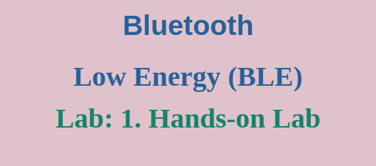
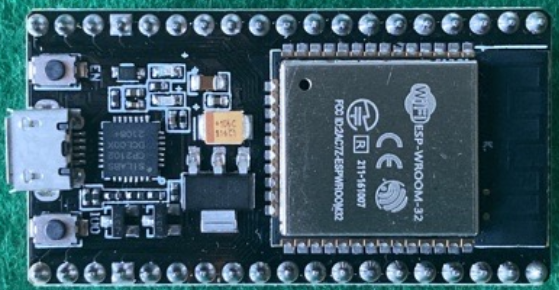
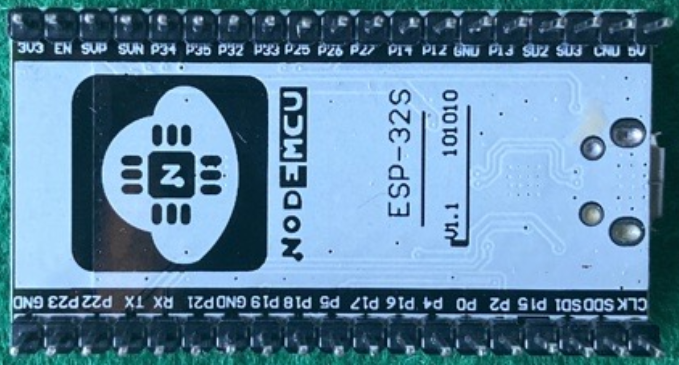
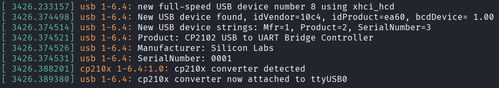
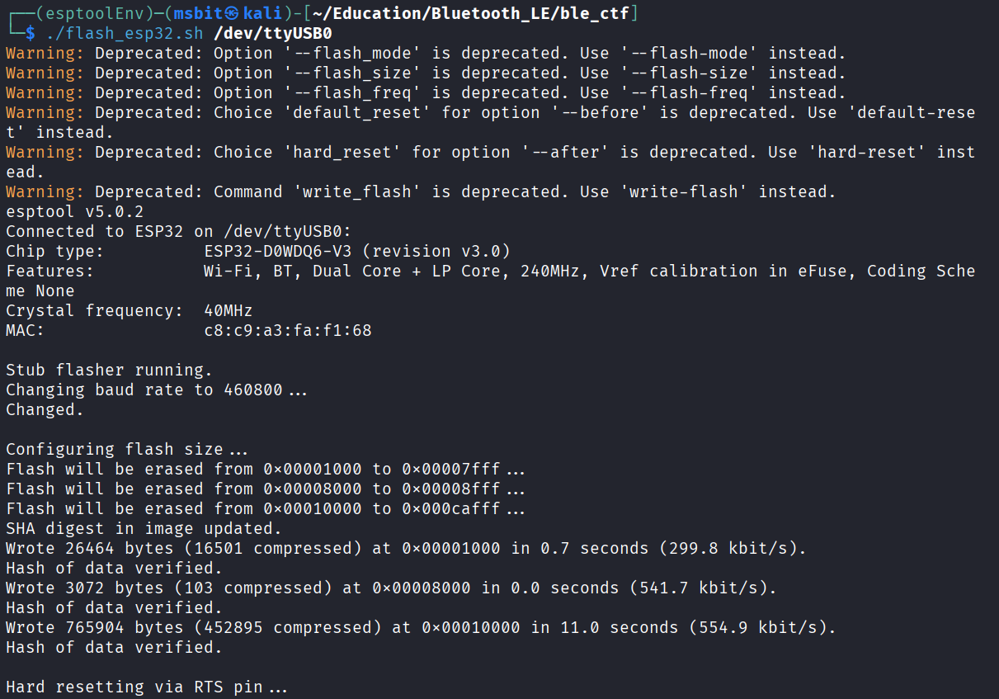

## Welcome to the Lab Session!

Theory is great, but the real learning happens when you get your hands dirty. In this module, we're going to set up a practical, fun lab environment where you can test everything we've learned about BLE. We'll be using a **BLE Capture the Flag** style setup, which is a fun way to learn security concepts.

---

## 1. Our Lab Setup

We'll build our lab around the **[BLE Capture the Flag (ble_ctf)](https://github.com/hackgnar/ble_ctf)** repository on GitHub. This gives us pre-made challenges to practice on.

Here's what you'll need in your digital toolbox:

| Component | Role in our Lab |
| :--- | :--- |
| **ESP32 Microcontroller** | The "vulnerable" device. This will be our BLE Peripheral running the custom firmware. |
| **Kali Linux VM/OS** | The hacker's Swiss Army knife. Our attacking machine, packed with all the tools we need. |
| **bluetoothctl** | A built-in Linux tool for managing Bluetooth devices. |
| **gatttool** | A classic command-line tool for performing GATT operations (read, write, notify). |
| **ble_ctf Firmware** | The custom software we'll flash onto the ESP32 to create our test target. |


## 2. Meet the ESP32: Your New Best Friend

The ESP32 is the star of our show. It's an incredibly popular, powerful, and—most importantly—**cheap** microcontroller.

*   **What it is:** A single chip that combines a dual-core processor, Wi-Fi, and **Bluetooth Low Energy (BLE)**!
*   **Why we use it:** It's easy to program, has great community support, and its BLE stack is widely used in real-world IoT devices.
*   **What it looks like:** The typical ESP32 DevKit has a USB port for power and programming, plenty of pins for expansion.

**Front View:**


**Back View:**


### Connecting Your ESP32

This part is easy.

1.  Plug your ESP32 into a free USB port on your Kali Linux machine.
2.  The system should detect it automatically. To confirm, open a terminal and run:
```bash
dmesg | tail
```

You should see kernel messages indicating a new USB serial device has been connected.


3.  Note the device name. It will almost always be `/dev/ttyUSB0` (if you don't have other serial devices). You can list it with:
```bash
ls -l /dev/ttyUSB*
# crw-rw----+ 1 root dialout 188, 0 Aug 27 16:49 /dev/ttyUSB0
```

> **Note:** If you don't see it, you may need to add your user to the `dialout` group to get permission to access it, and then log out and back in.
> 
> ```
>  sudo usermod -a -G dialout $USER
> ```

---


## 3. Flashing the Firmware

Now, let's turn this generic ESP32 into our dedicated BLE CTF target. "Flashing" just means uploading a new program to it.

### Step 1: Install the Flashing Tool (`esptool.py`)

We'll use Espressif's official tool, `esptool.py`. It's a Python script, so it works on any OS. Let's install it in a clean Python virtual environment.

```bash
# Create a directory for the tool and navigate to it
mkdir ~/esptool
cd ~/esptool

# Create a Python virtual environment to keep things tidy
python3 -m venv esptoolEnv

# Activate the virtual environment
source esptoolEnv/bin/activate

# Upgrade pip and install esptool
pip install --upgrade pip
pip install esptool
```

### Step 2: Get the CTF Firmware
Clone the ble_ctf repository from GitHub. The pre-compiled firmware we need is inside the `build` folder.
```
# Clone the repository
git clone https://github.com/hackgnar/ble_ctf
cd ble_ctf
```

### Step 3: The Flash Script

Flashing requires specifying several memory addresses for different parts of the firmware. To make this easy, we'll use a simple shell script.

Create a file named `flash_esp32.sh` (ensure inside `ble_ctf`) with the following content:
```
#!/bin/bash

# This script flashes the ble_ctf firmware to an ESP32
# Usage: ./flash_esp32.sh /dev/ttyUSB0

PORT=$1

# Check if the user provided a serial port
if [ -z "$PORT" ]; then
    echo "Usage: $0 <serial-port>"
    echo "Example: $0 /dev/ttyUSB0"
    exit 1
fi

# Use esptool.py with the correct parameters to write the firmware
esptool.py \
-p $PORT \
-b 460800 \
--before default-reset \
--after hard-reset \
--chip esp32 write-flash \
--flash-mode dio \
--flash-size 2MB \
--flash-freq 40m \
0x1000 build/bootloader/bootloader.bin \
0x8000 build/partition_table/partition-table.bin \
0x10000 build/ble_ctf.bin
```

### Step 4: Execute the Flash!

Make the script executable and run it, pointing it to your ESP32's device port.
```
# Make the script executable
chmod +x flash_esp32.sh

# Run the script! (Press the BOOT button on the ESP32 if it gets stuck)
./flash_esp32.sh /dev/ttyUSB0
```

The tool will erase the old firmware and write the new one. In a few seconds, your ESP32 will reboot and become a brand new BLE CTF target, ready for you to discover and hack!


In our next lesson, we'll power up our Kali machine and start using bluetoothctl and gatttool to interact with our new device. Get ready to put all that theory into practice!