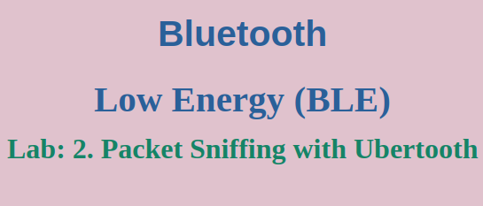
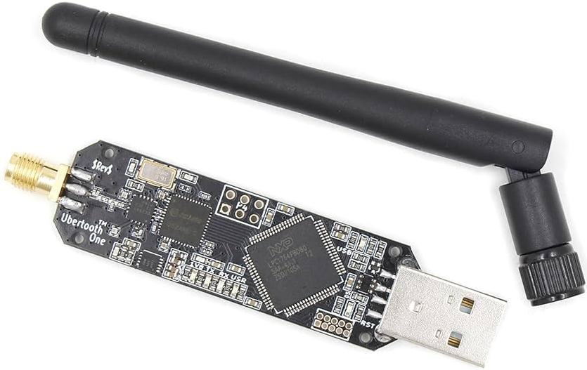
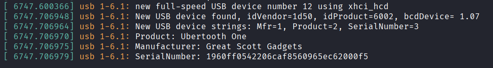
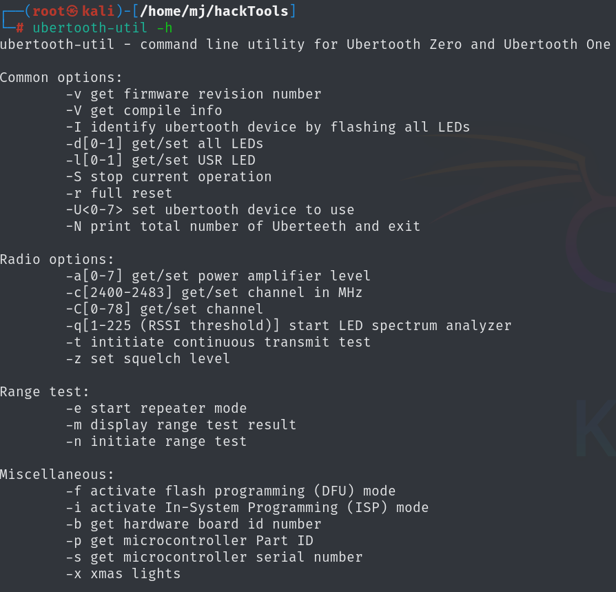
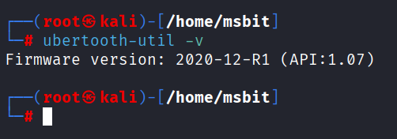
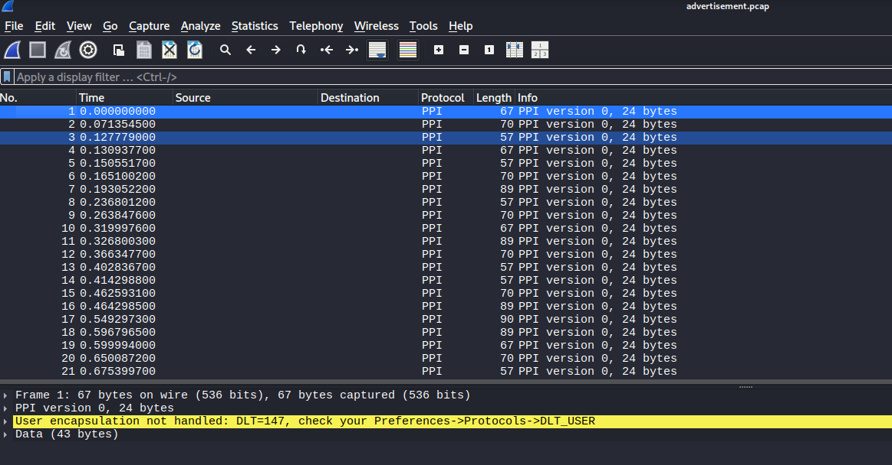
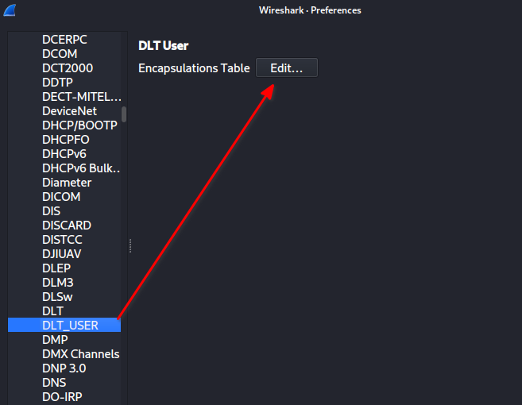
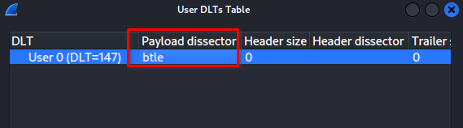
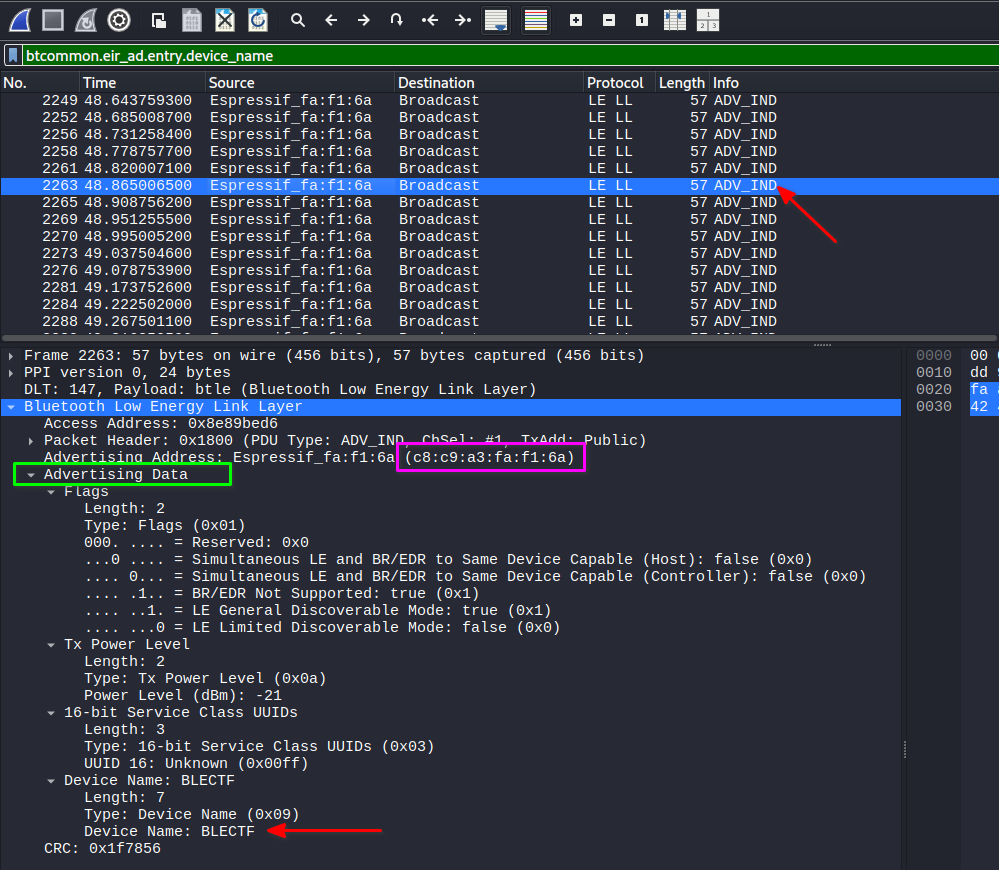

Alright, It's time to see the invisible. We've talked about advertising packets, connections, and data exchange. Now, let's actually *capture* these radio waves and analyze them.

To do this, we need a special tool: a Bluetooth sniffer.

---

## The Challenge of Sniffing BLE Connections

Before we dive into the tools, it's important to understand the core challenge of intercepting Bluetooth Low Energy traffic. Unlike Wi-Fi, where devices transmit on a fixed channel, BLE uses **adaptive frequency hopping** to avoid interference. This means a connected conversation rapidly jumps between 37 different data channels.

To successfully eavesdrop on an entire connection, a sniffer must:
1.  **Catch the initial handshake** on one of the three advertising channels.
2.  **Decode the connection parameters** from this handshake.
3.  **Synchronize with the hop pattern** and follow the conversation across all 37 data channels.

Fortunately, the BLE hopping pattern is less complex than Bluetooth Classic's. When a central device sends a connection request, the packet contains all the information needed to crack the code:

*   **Access Address:** A unique 4-byte identifier for the connection.
*   **Connection Interval (Hop Interval):** How long the devices stay on one channel before hopping.
*   **Hop Increment:** A value used to calculate the next channel in the sequence.
*   **CRC Initialization:** A 3-byte seed for error-checking calculations.

A tool like the Ubertooth One is designed to monitor the advertising channels, capture this critical connection request, and then automatically synchronize with the frequency-hopping pattern to capture the entire data exchange. **The key requirement is that the sniffer must be active *before* the connection is established.**

---

## 1. Our Tool of Choice: The Ubertooth One

Your computer's built-in Bluetooth adapter is designed to *participate* in connections, not silently observe them. For sniffing, we need a dedicated radio that can listen in passively.

**Ubertooth One**:


*   **What it is:** An open-source, low-cost Bluetooth sniffer. It's a specialized USB dongle that can monitor Bluetooth Classic and Low Energy traffic.
*   **How it works:** It acts as a passive receiver, capturing raw packets from the air and sending them to your computer for analysis.

### Connecting Your Ubertooth

1.  Plug your Ubertooth One into a USB port on your Kali machine.
2.  Let's verify the system sees it. Open a terminal and check the kernel messages:
```bash
dmesg | tail
```

You should see a message about a new USB device being attached.
    

---

## 2. Installation & Setup on Kali Linux

Kali Linux makes this easy for us, as it includes the `ubertooth` package in its repositories.

### Step 1: Install the Package
```
sudo apt update
sudo apt install ubertooth
```

There are two main tools:
- ubertooth-util: A general utility tool for Ubertooth One that provides functions such as flashing firmware, tuning, spectrum analysis, device testing, and configuration.
- ubertooth-btle: Used for sniffing, packet capture, and monitoring advertisements and connections between BLE devices.

### Step 2: Verify Installation and Firmware

Let's check that the tools work
```
ubertooth-util -h
```



Then to see the firmware version we can running.
```
sudo ubertooth-util -v
# Firmware version: 2020-12-R1 (API:1.07)
```


### Step 3: Updating the Firmware (If Needed)

If you need to update, download the latest release from the official GitHub page and flash it using the ubertooth-dfu tool.
```
# Download the latest release (replace the URL with the latest version if needed)
wget https://github.com/greatscottgadgets/ubertooth/releases/download/2020-12-R1/ubertooth-2020-12-R1.tar.xz

# Extract the archive
tar -xvf ubertooth-2020-12-R1.tar.xz

# Navigate to the firmware directory
cd ubertooth-2020-12-R1/ubertooth-one-firmware-bin/

# Flash the new firmware (-r resets the device after flashing)
sudo ubertooth-dfu -d bluetooth_rxtx.dfu -r
```


## 3. Capturing Packets!

Now for the fun part. We'll use the ubertooth-btle tool to capture only Bluetooth Low Energy traffic.
```
sudo ubertooth-btle -f -v -c advertisement.pcap
```

Let's break down those options:

`-f`: Follows connections. If it sees a connection request, it will hop along with the data channels and sniff the entire conversation.
`-c <filename>`: Writes the captured packets to a file in PCAP format (the standard format for packet captures).
`-v`: Adds verbose output to the console.

Point the Ubertooth near your ESP32 CTF target or any other BLE device (like a fitness tracker). You should see a stream of activity in your terminal as it captures advertising packets and, if applicable, connection data.


## 4. Analyzing the Capture in Wireshark

If you open the saved `~/advertisement.pcap` file in Wireshark immediately, you might hit a snag: Wireshark won't know how to interpret the data.


This is because the Ubertooth uses a custom format. We need to tell Wireshark how to decode it.

### Configuring Wireshark for Ubertooth
- Open Wireshark (you may need to run it as root to open the capture file: sudo wireshark).
- Go to Edit -> Preferences.
- In the preferences window, on the left sidebar, click on Protocols.
- Scroll down and find DLT_USER. Click on it.


- Click the Edit... button next to "Encapsulations Table".
- In the new window, click New.
- Configure the new entry as follows:
	- DLT: 147 (This is the number the Ubertooth uses)
	- Payload Protocol: btle
- Click OK, then OK again to close the preferences windows.



Now, open your `~/advertisement.pcap` file in Wireshark. You should see all the packets decoded clearly. You can filter for btle to display only BLE traffic, and click on any packet to drill down into its layers: the advertising header, MAC addresses, and the advertising data (AD structures). From this quick analysis, we can identify both the `BD_ADDR` and the name of our target ESP32:
- **Device Name**: `BLECTF`
- **BD_ADDR**: `C8:C9:A3:FA:F1:6A`



This provides a way to visualize and understand the wireless conversations happening all around you. Go forth and sniff!
