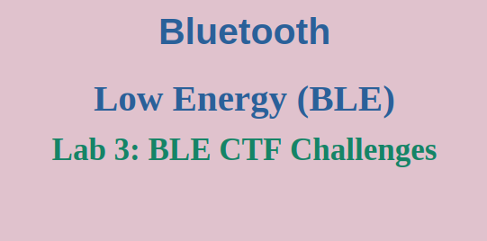
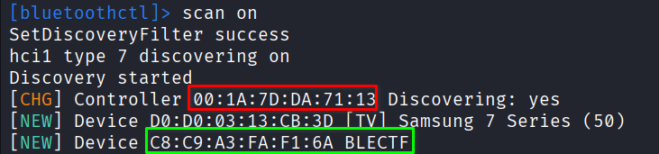
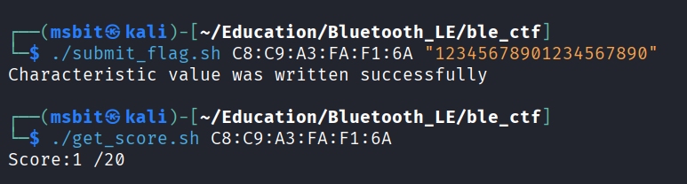

## Let the Games Begin!

Welcome to the main event! Now that our lab is set up and our ESP32 is flashed, it's time to start hacking. We'll be working through the challenges in the **[BLE Capture the Flag (ble_ctf)](https://github.com/hackgnar/ble_ctf)** repository.

The CTF is designed as a series of challenges. Each challenge requires you to find a "flag" by interacting with the BLE device and submit it to progress. Let's get your tools ready.

---

## 1. Pre-Flight Checklist

First, let's make sure our Bluetooth environment is ready.

### Enable Bluetooth Services
On your Kali Linux machine, ensure the Bluetooth service is enabled and running:
```
sudo systemctl enable bluetooth
sudo systemctl start bluetooth
```

### Find Your Target
We need to find the Bluetooth MAC address (BD_ADDR) of our ESP32 CTF device (we already found it during our sniffing lab). However, another way is by actively scanning for the presence of BLE devices. Ensure that the ESP32 is connected to your host machine, and let's use `bluetoothctl` to scan for it.
```
bluetoothctl
scan on
```

Look for a device with a name related to BLECTF or a manufacturer data field you recognize. Note its BD_ADDR address (in our case: C8:C9:A3:FA:F1:6A).



## 2. Your CTF Toolbox: Handy Scripts

Manually typing long gatttool commands gets tedious fast. I've created a few simple scripts to automate the common tasks you'll be doing for every challenge.

### Script 1: Check Your Score (get_score.sh)

This script reads from a specific characteristic that displays your current score (number of flags solved).
```
#!/bin/bash

# Check_score.sh - Reads the current CTF score from the device.
# Usage: ./get_score.sh <MAC_ADDRESS>

MAC="$1"

if [ -z "$MAC" ]; then
    echo "Usage: $0 <BLE-MAC>"
    exit 1
fi

# Read the characteristic at handle 0x002a, decode the hex output to ASCII
gatttool -b "$MAC" --char-read -a 0x002a 2>/dev/null \
    | awk -F':' '{print $2}' \
    | tr -d ' ' \
    | xxd -r -p

echo # Add a newline for clean output
```

Make it executable and run it:
```
chmod +x get_score.sh
./get_socre.sh <MAC>
```

### Script 2: Submit a Flag (submit_flag.sh)

This script writes your discovered flag to the submission characteristic. You need to supply the `BD_ADDR` and the flag as parameters.

```
#!/bin/bash

# submit_flag.sh - Submits a flag to the CTF server on the device.
# Usage: ./submit_flag.sh <MAC_ADDRESS> <FLAG_STRING>

MAC="$1"
FLAG="$2"

if [ -z "$MAC" ] || [ -z "$FLAG" ]; then
    echo "Usage: $0 <BLE-MAC> <FLAG>"
    exit 1
fi

# Convert the flag string to hex and write it to handle 0x002c
gatttool -b "$MAC" --char-write-req -a 0x002c -n $(echo -n "$FLAG" | xxd -ps)
```

Make it executable and use it:
```
chmod +x submit_flag.sh
./submit_flag.sh <MAC> <FLAG>
```


### Script 3: Hex to ASCII Converter (hex_to_ascii.sh)

You will constantly be converting hex output from `gatttool` into readable text. This script does it instantly.
```
#!/bin/bash

# hex_to_ascii.sh - Converts a hex string to ASCII.
# Usage: ./hex_to_ascii.sh <HEX_STRING>

if [ $# -ne 1 ]; then
    echo "Usage: $0 <HEX_STRING>"
    exit 1
fi

HEX_STRING="$1"
echo "$HEX_STRING" | xxd -r -p
```

For example:
```
chmod +x hex_to_ascii.sh
./hex_to_ascii.sh "68656c6c6f20776f726c64"
# hello world
```


## 3. Solving Your First Flag: A Walkthrough

Let's walk through Flag 1 together. This challenge is designed to teach you the process of reading hints and submitting flags.

1. Check Your Starting Score:
```
./get_score.sh C8:C9:A3:FA:F1:6A
# Score:0 /20
```
Confirmed, we haven't solved anything yet.

2. Read the hint it jsut tell you to submit this flag to the server `12345678901234567890`.

```
./submit_flag.sh C8:C9:A3:FA:F1:6A "12345678901234567890"

```

3. Verify Your Success!
```
./get_score.sh C8:C9:A3:FA:F1:6A
# Score:1 /20
```


Congratulations! You've solved your first flag. Your score is now 1.

>Important Note: The CTF device is stateless. If you power off or reset the ESP32, your progress (score) will be reset.

Now you're ready to tackle the rest. Use your knowledge of the GATT hierarchy and your new scripting skills to explore the device and find all the flags!

Good luck, and happy learning!