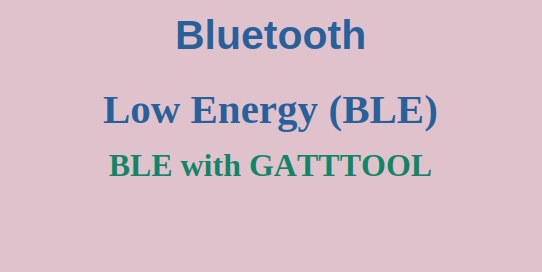
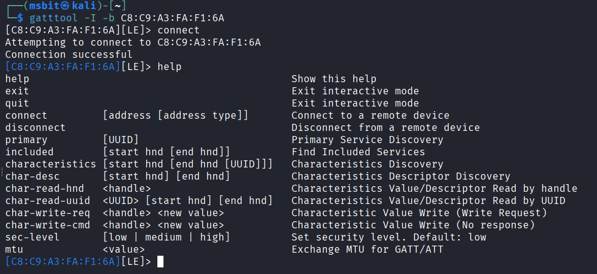
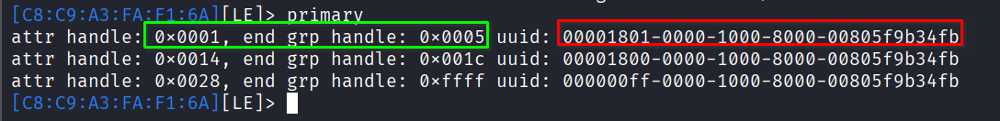
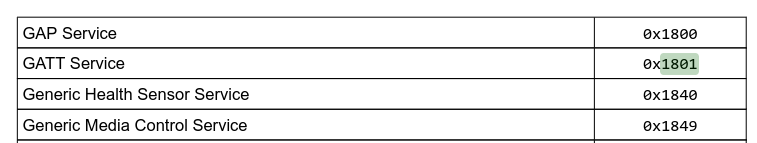
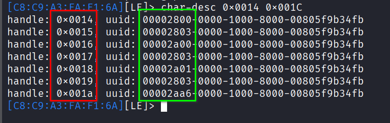
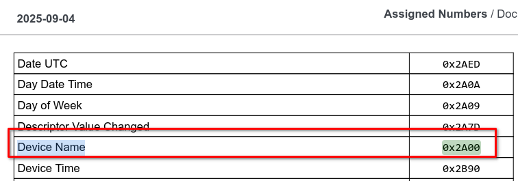
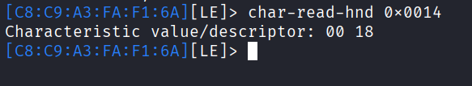
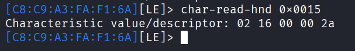
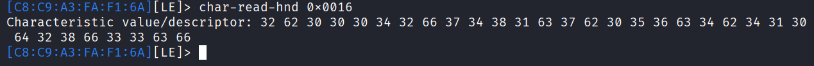

## Introduction to GATTTOOL
`gatttool` is a powerful command-line utility for interacting with Bluetooth Low Energy (BLE) devices. It allows you to discover services, characteristics, and descriptors, as well as read and write values to a BLE device.

Now, let’s use `gatttool`. Here are the fundamental commands you’ll need to know:
```
# Start gatttool in interactive mode with a specific device MAC address
gatttool -I -b C8:C9:A3:FA:F1:6A

# Connect to the device
connect

# Display available commands
help

# Exit the tool
exit
```



## Primary Service Discovery
Once connected, the first step is discovering what services the device offers:
```
[C8:C9:A3:FA:F1:6A][LE]> primary
attr handle: 0x0001, end grp handle: 0x0005 uuid: 00001801-0000-1000-8000-00805f9b34fb
attr handle: 0x0014, end grp handle: 0x001c uuid: 00001800-0000-1000-8000-00805f9b34fb
attr handle: 0x0028, end grp handle: 0xffff uuid: 000000ff-0000-1000-8000-00805f9b34fb
```



Each line corresponds to a primary service declaration:
- **attr handle**: The starting handle of the service
- **end grp handle**: The last handle that belongs to this service
- **uuid**: The service's Universally Unique Identifier

Some UUIDs are standardized by the [Bluetooth SIG](https://www.bluetooth.com/wp-content/uploads/Files/Specification/HTML/Assigned_Numbers/out/en/Assigned_Numbers.pdf), while others are custom/proprietary. You can reference the Bluetooth SIG specifications to identify common services.


All handles between the start and end are "owned" by that service, and you can use them to discover or read/write characteristics.

| Start  | End    | UUID | Service                    |
| ------ | ------ | ---- | -------------------------- |
| 0x0001 | 0x0005 | 1801 | Generic Attribute (GATT)   |
| 0x0014 | 0x001C | 1800 | Generic Access (GAP)       |
| 0x0028 | 0xFFFF | 00FF | Custom/Proprietary Service |

## Characteristic Discovery
To discover characteristics within a specific service, we can use the `char-desc` command with the service's start and end handles. Let's take the 1800 Generic Access (GAP) service as an example:

```
[C8:C9:A3:FA:F1:6A][LE]> char-desc 0x0014 0x001C
handle: 0x0014, uuid: 00002800-0000-1000-8000-00805f9b34fb
handle: 0x0015, uuid: 00002803-0000-1000-8000-00805f9b34fb
handle: 0x0016, uuid: 00002a00-0000-1000-8000-00805f9b34fb
handle: 0x0017, uuid: 00002803-0000-1000-8000-00805f9b34fb
handle: 0x0018, uuid: 00002a01-0000-1000-8000-00805f9b34fb
handle: 0x0019, uuid: 00002803-0000-1000-8000-00805f9b34fb
handle: 0x001a, uuid: 00002aa6-0000-1000-8000-00805f9b34fb
```


Also, we can find out the meaning of each UUID from the Bluetooth SIG specification.


Let's take the first characteristic, the Device Name, as an example:

- **Handle: 0x0015, UUID: 2803 (Characteristic Declaration)**: This is the header or declaration for the characteristic that follows. It doesn't contain the device name itself. Instead, it contains important metadata about the characteristic, including:
	- Properties: (e.g., Read, Write, Notify) defining what you can do with it.
	- Value Handle: A pointer to the handle where the actual value is stored (in this case, 0x0016).

- **Handle: 0x0016, UUID: 2a00 (Device Name Characteristic)**: This is the value handle. This is where the actual data (e.g., "My Fitness Tracker") is stored. You read from and write to this handle.

So, the pair 0x0015 and 0x0016 work together to define one complete characteristic: `Device Name`.

This pattern repeats for every characteristic in the service:
- 0x0017 (Declaration) -> 0x0018 (Value for Appearance)
- 0x0019 (Declaration) -> 0x001A (Value for Central Address Resolution)

| Handle | UUID (Short) | Type    | What it Does          | Related To                          |
| ------ | ------------ | ------- | --------------------- | ----------------------------------- |
| 0x0014 | 0x2800       | Service Declaration        | Declares the start of the Generic Access service (0x1800). | Parent of all handles below         |
| 0x0015 | 0x2803       | Characteristic Declaration | Metadata for the Device Name characteristic.               | Points to the value at 0x0016       |
| 0x0016 | 0x2A00       | Characteristic Value       | The actual Device Name data.                               | Value for the declaration at 0x0015 |
| 0x0017 | 0x2803       | Characteristic Declaration | Metadata for the Appearance characteristic.                | Points to the value at 0x0018       |
| 0x0018 | 0x2A01       | Characteristic Value       | The actual Appearance data.                                | Value for the declaration at 0x0017 |
| 0x0019 | 0x2803       | Characteristic Declaration | Metadata for the Central Address Resolution.               | Points to the value at 0x001A       |
| 0x001A | 0x2AA6       | Characteristic Value       | The actual Central Address Resolution data.                | Value for the declaration at 0x0019 |

Now, let's read the handles using the `char-read-hnd` command. We’ll break down the output of each command and explain the meaning of the returned bytes.

### Reading handle 0x0014

```
[C8:C9:A3:FA:F1:6A][LE]> char-read-hnd 0x0014
Characteristic value/descriptor: 00 18
```

Handle 0x0014 is the Service Declaration for the Generic Access service.
- 00 18: This is the little-endian representation of the service UUID, which corresponds to 0x1800, as we saw when we ran the `primary` command.

### Reading handle 0x0015

```
char-read-hnd 0x0015
Characteristic value/descriptor: 02 16 00 00 2a 
```

Handle 0x0015 is a Characteristic Declaration that describes the properties of the characteristic and points to its value handle. When we read it, there are 5 bytes:

- 02 - Properties: Defines what operations are permitted
	- Bitmask where: 0x02 = READ (0b00000010)
	- Other common flags: 0x04 = WRITE, 0x08 = NOTIFY, 0x10 = INDICATE

- 16 00 - Value Handle in little-endian format, which becomes 0x0016
	- This is the handle where the actual characteristic value is stored

- 00 2a - Characteristic UUID in little-endian format, which becomes UUID 0x2A00
	- This corresponds to the Device Name Characteristic

This declaration tells us:
- The characteristic at handle 0x0016 can be read (0x02)
- The characteristic UUID is 0x2A00 (Device Name)
- The actual device name value is stored at handle 0x0016

### Reading handle 0x0016
```
char-read-hnd 0x0016
Characteristic value/descriptor: 32 62 30 30 30 34 32 66 37 34 38 31 63 37 62 30 35 36 63 34 62 34 31 30 64 32 38 66 33 33 63 66 
```


Handle 0x0016 contains the actual Characteristic Value — in this case, the device name. These bytes represent the device name in hexadecimal ASCII values.