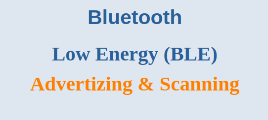
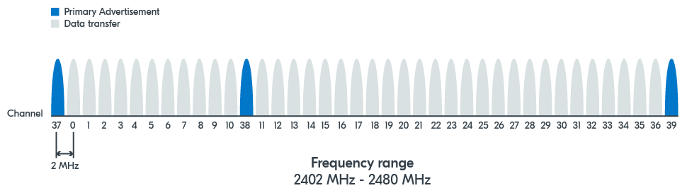
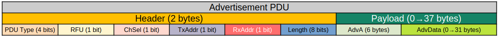

Today, we're diving into one of the most fundamental concepts in Bluetooth Low Energy: **Advertising and Scanning**. This is how BLE devices introduce themselves and find each other in the wild. 

Let's break down how this party works.

---

## 1. Why Advertise? The Two Main Goals

A BLE device sends out advertisements for two reasons:

1.  **To Broadcast Data:** To shout information into the void for any device that's listening (e.g., a beacon in a museum broadcasting its location: "I'm near the Mona Lisa!").
2.  **To Be Discoverable:** To announce, "Hey, I'm here and available for a connection!" This is what your wireless headphones do when you put them in pairing mode.

---

## 2. The Advertising Process: How to Shout

### The Advertising Interval

An advertising device doesn't scream continuously. That would waste battery. Instead, it sends out small packets of data **periodically**.

*   **Advertising Interval:** This is the time *between* the start of one advertising packet and the start of the next. It can be set anywhere from **20 milliseconds** to **over 10 seconds**.
	*   **Short Interval (e.g., 20ms):** Faster discovery, but **higher power consumption**.
	*   **Long Interval (e.g., 1s):** Slower discovery, but **much lower power consumption**.

> **Key Concept:** Tuning the advertising interval is a primary way to balance battery life with how quickly a user can find and connect to a device.

### The Advertising Channels

The 2.4 GHz band used by BLE is like a crowded highway with 40 lanes (channels). To make sure its message gets through the noise, an advertiser uses a specific strategy.

*   **Primary Advertising Channels (37, 38, 39):** These are three specific "lanes" reserved just for introductions. An advertising packet is sent out on **all three of these channels, one after the other**.
*   **Why Three Channels?** It's for **redundancy**. If one channel is clogged with Wi-Fi interference, the packet might get through on another.
*   **Secondary Data Channels (0-36):** These are the other 37 lanes, used almost exclusively for **high-speed data transfer *after* a connection is established**.

---

## 3. How You Advertise: Advertising Types

Not all shouts are the same. The *type* of advertisement tells scanners exactly what the advertiser is willing to do. There are four main types in "legacy" advertising:

| Advertising Type (PDU Type) | Connectable? | Scannable? | Best For... |
| :--- | :--- | :--- | :--- |
| **`ADV_IND`** (Connectable Undirected) | ✅ Yes | ✅ Yes | **The standard.** Use this when your device wants to be found *and* connected to. (e.g., a fitness tracker). |
| **`ADV_DIRECT_IND`** (Connectable Directed) | ✅ Yes | ❌ No | **Fast reconnection.** The packet contains a *specific* device's address to reconnect to. No scan responses allowed. (e.g., a mouse reconnecting to its PC). |
| **`ADV_SCAN_IND`** (Scannable Undirected) | ❌ No | ✅ Yes | **Beaconing.** For devices that broadcast data and allow scan requests for more info, but **cannot be connected to**. (e.g., an iBeacon). |
| **`ADV_NONCONN_IND`** (Non-connectable Undirected) | ❌ No | ❌ No | **Pure broadcasting.** Just shouts data and ignores everyone else. No connections, no scan requests. (e.g., a simple temperature sensor broadcaster). |

---

## 4. The Other Side: Scanning

If advertising is shouting, then **scanning is listening**.

*   **Scan Interval:** How often the scanner wakes up to listen. (e.g., "I'll check for shouts every 100ms").
*   **Scan Window:** How *long* it listens each time it wakes up. (e.g., "Each time I check, I'll listen for 20ms").
*   **The Duty Cycle:** The ratio of `Scan Window` to `Scan Interval` determines how diligent the scanner is. A scanner with a long window and short interval will find devices faster but use more power.

A scanner listens on each of the three advertising channels, hopping between them to catch any advertisements.

### The Conversation: Scan Requests & Responses

When a scanner hears an advertisement, it can ask for more information!

1.  The Peripheral advertises with a basic packet (`ADV_IND` or `ADV_SCAN_IND`).
2.  The Central sends a **Scan Request** ("Hey, that's interesting, tell me more!").
3.  The Peripheral responds with a **Scan Response** packet.

This allows a device to keep its initial advertisement packet very small and efficient, only sending extra data (like its full name) if someone specifically asks for it.

---

## 5. Anatomy of an Advertisement Packet

Let's look at what's inside these tiny data packets.

### The Advertising PDU (Protocol Data Unit)

Every packet has a header and a payload.

**The Header tells the scanner how to interpret the packet and the Payload contains the actual data**

*   **PDU Type:** It defines the advertising type (`ADV_IND`, `ADV_SCAN_IND`, etc.).
*   **TxAdd/RxAdd:** Flags indicating if the transmitter and receiver addresses are **Public** (0) or **Random** (1).
*   **Length:** The length of the payload that follows.

For a standard undirected advertisement (`ADV_IND`)
*   **AdvA (6 bytes):** The Bluetooth Address of the advertiser.
*   **AdvData (0-31 bytes):** The actual data being broadcasted. This is where the good stuff is!

And that's the lowdown on advertising! It's a sophisticated system of efficient, structured shouting and listening that makes the entire BLE ecosystem possible.