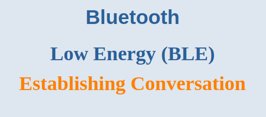

Now that we understand how BLE devices introduce themselves (advertising), let's talk about how they start a sustained conversation. This process is called **forming a connection**. It's where the real, bidirectional data exchange happens.

---

## 1. The Connection Handshake

Establishing a connection is a two-device dance with very clear roles, just like asking someone to dance.

1.  **The Advertisement:** A **Peripheral** (like a heart rate sensor) begins advertising. It's essentially saying, "I'm here and available to talk!" It uses one of the connectable advertising types (`ADV_IND` or `ADV_DIRECT_IND`).

2.  **The Decision:** A **Central** device (like your phone) is scanning. It picks up the peripheral's advertisement packet. The central's application layer looks at the data inside (e.g., the device name, services offered) and decides, "Yes, I want to connect to this device."

3.  **The Request:** The central sends a **CONNECT_REQ** packet. This is a formal invitation to start a connection.

4.  **Acceptance:** If the peripheral successfully receives and accepts the `CONNECT_REQ` packet, the connection is established! A bi-directional, reliable communication channel is now open between them.

---

## 2. Life Inside a Connection

Once connected, the rules of engagement change completely.

### Switching Channels

*   **Advertising Channels:** The introduction happened on channels 37, 38, and 39.
*   **Data Channels:** The entire conversation now moves to the other **37 data channels (0-36)**. This leaves the advertising channels free for other devices to discover each other.

### Frequency Hopping

The 2.4 GHz band is noisy. To avoid interference from Wi-Fi, microwaves, and other Bluetooth connections, BLE uses a technique called **adaptive frequency hopping**.

*   The two devices agree on a complex pattern to hop between the 37 data channels.
*   They constantly change the channel they're using for each transmission.
*   If one channel is noisy, they automatically mark it as "bad" and avoid it.
*   This makes the connection robust and reliable despite a crowded radio environment.

### Connection Events & Intervals: The Heart of BLE Efficiency

This is the most important power-saving feature of a BLE connection. **Both devices spend most of their time *asleep*.**

*   **Connection Interval:** This is the time *between* conversations. It's the agreed-upon interval at which both devices wake up, turn on their radios, and check for data. It's set by the Central in the `CONNECT_REQ` packet and can be renegotiated later.
    *   **Typical Values:** Ranges from **7.5 ms** (very fast, high power) to **4 seconds** (very slow, ultra-low power).
    *   **Trade-off:** A shorter interval means lower latency (faster response) but higher power consumption. A longer interval saves significant power but adds delay.

*   **Connection Event:** This is the pre-scheduled "meeting time" that happens every connection interval. During this brief window:
    *   Both devices wake up and sync up.
    *   They can exchange multiple data packets if needed.
    *   If there is no application data to send, they exchange empty packets just to maintain synchronization. Think of it as saying, "I'm still here, just checking in."
    *   After the event, they both go back to sleep until the next interval.

### Reliability: Acknowledgment and Retries

To ensure no data is lost, BLE uses a simple acknowledgment protocol.

*   Every data packet must be acknowledged (`ACK`) by the receiver.
*   If the sender doesn't receive an `ACK`, it will **retransmit the packet** at the next connection event.
*   This happens infinitely until the packet is acknowledged **or the connection is terminated** due to a timeout.

---

## 3. Ending the Conversation: Disconnection

All good things must come to an end. A connection can be terminated in two ways:

### 1. Polite Goodbye (Application-Initiated Disconnect)

*   **How:** Either device (central or peripheral) can decide to end the connection gracefully. It sends a termination packet with a `DISCONNECT` command.
*   **The Reason:** This packet contains a **"Reason" field** that explains why it's disconnecting (e.g., "User terminated connection," "Remote Device Terminated Connection due to Low Resources").
*   **Analogy:** Hanging up the phone after saying goodbye.

### 2. The Ghosting Timeout (Supervision Timeout)

*   **How:** This is a safety net. Every connection has a **Supervision Timeout** parameter—a timer that resets every time a packet is successfully received.
*   **Why:** If one device crashes, loses power, or moves out of range, it can't send a polite goodbye. The other device would wait forever.
*   **The Solution:** If no valid packets are received for the entire duration of the Supervision Timeout, the connection is automatically declared lost and terminated.
*   **Typical Values:** The timeout is a multiple of the connection interval, often set to several seconds.
*   **Analogy:** Waiting for a friend who never shows up. After a reasonable amount of time (the timeout), you give up and leave.

And that's the lifecycle of a BLE connection! It's a masterclass in efficiency, using scheduled meetings and robust protocols to enable wireless communication on a coin-cell battery.