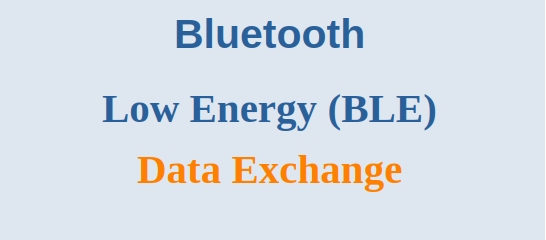
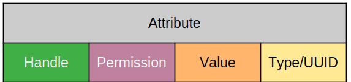
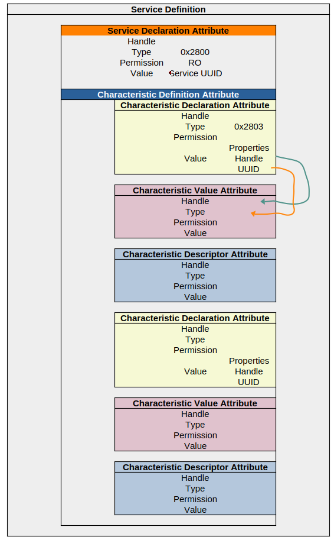

Now that we know how devices find each other and connect, let's talk about *how they talk*. This is where the **Generic Attribute Profile (GATT)** defines the rules of conversation. It's the language that allows a client to read, write, and subscribe to data on a server.

---

## 1. The GATT Conversation: Operations

Remember, the **GATT Server** (usually the Peripheral) holds the data. The **GATT Client** (usually the Central) wants to access it. But before any conversation can happen, the client must first figure out what topics the server can discuss.

### Step 1: Service Discovery

Imagine walking into a library for the first time. You don't just start grabbing books; you first look at the map or ask the librarian where sections are. This is **Service Discovery**.

*   The client asks the server: "What **Services** and **Characteristics** do you have?"
*   The server responds with a list: "I have a `Battery Service` with a `Battery Level` characteristic, and a `Custom Sensor Service` with a `Sensor Value` characteristic."
*   Only *after* this discovery process does the client know what data is available and how to ask for it.

### Client-Initiated Operations (The Client Asks)

These are operations where the client initiates the request.

| Operation | How It Works | Analogy | Response Required? |
| :--- | :--- | :--- | :--- |
| **Read** | The client sends a **Read Request** for a specific characteristic's value. The server responds with the value. | Asking a question: "What's the temperature?" | ✅ Yes |
| **Write** | The client sends a **Write Request** with new data for a characteristic. The server applies the change and sends an acknowledgment. | Giving a command: "Set the interval to 1 second." | ✅ Yes |
| **Write without Response** | The client writes data but **does not wait** for an acknowledgment from the server. This is faster but less reliable. | Shouting a command into a walkie-talkie and not waiting for a "copy." | ❌ No |

### Server-Initiated Operations (The Server Tells)

This is one of the most powerful features of BLE: the server can send data *without being asked*. But first, the client must give its permission.

*   **Subscription:** Before a server can send data, the client must **subscribe** to a characteristic. This is like raising your hand and saying, "Tell me whenever this value changes."

| Operation | How It Works | Analogy | Ack Required? | Best For |
| :--- | :--- | :--- | :--- | :--- |
| **Notify** | The server automatically pushes new data to the client. The client **does not acknowledge** receipt. | A news alert on your phone. You read it, but you don't have to confirm you saw it. | ❌ No | Frequent, low-power data updates (e.g., sensor readings). |
| **Indicate** | The server pushes data, but the client **must acknowledge** receipt. This guarantees delivery. | Sending a registered letter. The post office requires a signature to confirm you got it. | ✅ Yes | Critical data that must not be lost (e.g., a door lock command). |

---

## 2. The Building Blocks: Attributes, UUIDs, Services & Characteristics

### The Attribute: The Fundamental Data Unit (ATT Level)

All data is stored in structures called **Attributes**. Think of an attribute as a single cell in a spreadsheet.

Every attribute has four key parts:

1.  **Handle:** A unique 2-byte address that the client uses to access the attribute.
2.  **Type (UUID):** A label that defines *what kind of data* this attribute holds (e.g., "Battery Level," "Device Name").
3.  **Permissions:** Security rules specifying who can read or write this data (e.g., "Read only," "Encrypted write").
4.  **Value:** The actual data itself (e.g., `95` for 95% battery).

### UUIDs: The Universal Labels

The **UUID** (Universally Unique Identifier) in the "Type" field is how we identify what an attribute represents. There are two way to represent UUID:
*   **Long: 128-bit UUID (Vendor Specific):** custom UUID you generate for your own proprietary services and characteristics.
    *   *Example:* `0000180F-0000-1000-8000-00805f9b34fb` for your company's custom data.

*   **Shore: 16-bit UUID (Bluetooth SIG Defined)** standardized numbers for common functions. All official services and characteristics use these.
    *   *Example:* `0x180F` is the UUID for the **Battery Service**. `0x2A19` is the UUID for the **Battery Level Characteristic**.

> **Pro Tip:** The 16-bit UUIDs are actually a shortcut. They are inserted into a Bluetooth base UUID to form a full 128-bit UUID: `0000xxxx-0000-1000-8000-00805f9b34fb`. The stack handles this conversion automatically.

### Services: The Container (GATT Level)

A **Service** is a container that groups together related characteristics. It starts with a special attribute called the **Service Declaration** Followed by **Characteristc Definition** Attributes, a service can have zero or more characteristic definitions 

##### Service Declaration attribute
Service declaration attribute consists of:
*   **Handle:** The unique address for this declaration.
*   **Type:** *Always* the UUID `0x2800` (the universal code for "this is a service declaration") for Primary Service Declaration and the UUID `0x2801` for Secondary Service Declaration
*   **Permissions:** Almost always "Read only, no encryption."
*   **Value:** The most important part! This field contains the **UUID of the service itself** (e.g., `0x180F` for the Battery Service).

This declaration acts as a header that says, "Everything that follows, until the next service declaration, belongs to *this* service."

##### Characteristc Definition: The Actual Data (GATT Level)
- Each **Characteristc Definition** Attributes starts with a **Characteristic Declaration** attribute, to indicate the beginning of a characteristic and it is made of:
	- **Handle**: where the actual value of this characteristic is stored.
	- **Type (UUID)**: holds the UUID (0x2803) used only to declare a characteristic. (e.g., heart rate, battery level).
	- **Permission**: read-only Permissions, ensuring that clients can read the value but not write to it.
	- **Value** holds important information about the characteristic being declared, specifically three separate fields:
		- **Characteristic properties**: What kind of GATT operations are permitted on this characteristic.
		- **Characteristic value handle**: The handle (address) of the attribute that contains the user data (value), i.e the characteristic value attribute.
		- **Characteristic UUID**: The UUID of the characteristic being declared.

* **Characteristic Value**: 
	- **Handle** this is from Characteristic Declaration -> value -> Characteristic value handle
	- **Type (UUID)** this is from Characteristic Declaration -> value -> Characteristic UUID
	- **Permission**: whether the client can read and/or write to this attribute.
	- **Value**: It holds the actual data value (e.g., 95% battery level).

* **Characteristic Descriptors (Optional)**: additional attributes that provide more information about the characteristic's value.

This structure is what allows a client to easily discover what a server can do and how to interact with it efficiently.

## PDU Exchange Methods
The Attribute Protocol outlines methods for both reading and writing
attributes, totaling six distinct methods, each associated with a specific PDU.
In the context of the ATT protocol, a PDU represents the packet that is
exchanged with the lower layer – specifically, the L2CAP layer. This packet is
then encapsulated for transmission over the physical link or sent to the upper
layers.

The six methods and their corresponding PDU types are categorized as
follows: command, request, response, notification, indication, and confirmation.
Additionally, certain Attribute Protocol PDUs may include an Authentication
Signature, providing a means of authenticating the PDU’s originator without
necessitating encryption. The combination of the method and the signed bit is
referred to as the opcode.

Type Purpose Suffix
Commands: Sent to a server by a client that does not invoke a response. CMD
Requests Sent to a server by a client that invokes a response. REQ
Responses Sent to a client by a server in response to a request. RSQ
Notifications Sent to a client by a server that does not invoke a confirmation. Unsollicited PDUs. NTF
Indications Sent to a client by a server that invokes a confirmation. Unsollicited PDUs.IND
Confirmations Sent to a server by a client to confirm receipt of an indication. CFM

Attribute PDUs have the following format:

The Attribute Opcode is composed of three fields, the Authentication Signature Flag, the Command Flag, and the Method. The Method is the 6th bit value that determines the format and meaning of the Attribute Parameters.

If the Authentication Signature Flag of the Attribute Opcode is set to one, the Authentication Signature value shall be appended to the end of the attribute PDU, and X is 13. If the Authentication Signature Flag of the Attribute Opcode is set to zero, the Authentication Signature value shall not be appended, and X is 1

|Name |Size (bytes) Description|
|Attribute Opcode| 1 | The attribute PDU operation code
bit 7: Authentication Signature Flag
bit 6: Command Flag
bits 5-0: Method|

| Attribute parameters| 0 to (ATT_MTU - X) | The attribute PDU parameters
X = 1 if Authentication Signature Flag of the. Attribute Opcode is 0
X = 13 if Authentication Signature Flag of the
Attribute Opcode is 1|

| Autentication Signature| 0 to 12 | Optional authentication signature for the Attribute Opcode and Attribute Parameters|

If the packet is received as anticipated without issues, the protocol specifies
the corresponding actions that the receiving end should take upon success. In
the event of an error, the protocol includes provisions for an error response,
indicating the source of the error.