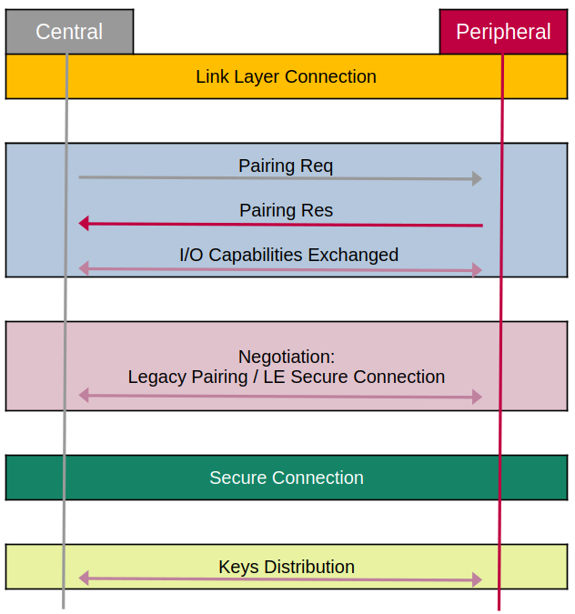

Today we're covering **Security** features in BLE. When our BLE devices are transmitting sensitive data like health information or door lock codes, we need to ensure that conversation is private and secure from eavesdroppers. Let's break down how BLE accomplishes this.

---

## 1. The Core Concepts: Pairing vs. Bonding

First, let's get our terminology straight, as these two terms are often confused:

*   **Pairing:** This is the **process** of establishing a secure connection *for the first time*. It's the handshake where two devices meet, verify each other's identity, and agree on a secret key. Think of it as two diplomats meeting for the first time and exchanging sealed credentials.
*   **Bonding:** This is the **result** of successful pairing. The devices *store* the secret keys they generated in a trusted device list. The next time they meet, they can skip the lengthy pairing process and immediately resume their secure connection using the stored keys. This is like saving a friend's number in your phone—future calls are instant and trusted.

---

## 2. The Three Phases of Pairing

The pairing process is a structured, three-phase conversation managed by the Security Manager Protocol (SMP).

### Phase 1: Pairing Initiation ("What can you do?")

This phase is all about negotiation. The **central** sends a `Pairing Request` and the **peripheral** responds with a `Pairing Response`. They exchange their **I/O Capabilities** to figure out the most secure method they can both support.

These capabilities determine how a device can interact with a user:

| I/O Capability | Input? | Output? | Example Device |
| :--- | :--- | :--- | :--- |
| **DisplayOnly** | ❌ No | ✅ Yes | A beacon that shows a code but has no buttons. |
| **DisplayYesNo** | ✅ (Simple) | ✅ Yes | A smartwatch with a screen and two buttons. |
| **KeyboardOnly** | ✅ Yes | ❌ No | A keyboard. |
| **NoInputNoOutput** | ❌ No | ❌ No | A simple sensor with no interface. |
| **KeyboardDisplay** | ✅ Yes | ✅ Yes | A smartphone. |

### Phase 2: Key Generation ("Let's make a secret")

This is where the magic happens. The devices generate the keys that will be used to encrypt the link. The method they use depends on whether they support modern security or not.

#### **The Old Way: LE Legacy Pairing (Pre-4.2)**
1.  Devices agree on a **Temporary Key (TK)** using one of the methods below.
2. The TK is used to generate a **Short Term Key (STK)**.
3.  **Problem:** The STK is relatively weak and can be cracked, making legacy pairing vulnerable.

#### **The Modern Way: LE Secure Connections (Bluetooth 4.2+)**
1.  Devices use powerful **Elliptic-Curve Diffie-Hellman (ECDH)** cryptography to generate public and private keys. This is the same math that secures HTTPS connections on the web.
2.  They exchange public keys.
3.  They use one of the methods below to *authenticate* that the exchange hasn't been tampered with.
4.  This process directly generates a strong **Long Term Key (LTK)**.

**The Pairing Methods (How they agree on authenticate the key):**

| Method | How It Works | Security Level | Best For... |
| :--- | :--- | :--- | :--- |
| **Just Works** | Automatically accepts. No user interaction. | **Level 2 (Unauthenticated)** | Low-risk devices where convenience is key (e.g., a toy). **Vulnerable to MITM.** |
| **Passkey Entry** | User enters a 6-digit code from one device into the other. | **Level 3 (Authenticated)** | Devices where one has a display and the other has a keyboard (e.g., phone ↔ keyboard). |
| **Numeric Comparison** (Secure Conn. only) | Both devices show a 6-digit code. User confirms they match. | **Level 4 (Authenticated)** | Two devices with displays (e.g., phone ↔ laptop). Protects against MITM. |
| **Out of Band (OOB)** | Key is shared via a different, secure channel (e.g., NFC). | **Level 3/4 (Authenticated)** | High-security applications. Security depends on the OOB channel. |

### Phase 3: Key Distribution ("Here are your keys")

Now that the secure link is established with the LTK, the devices use it to securely exchange other useful keys:
*   **Identity Resolving Key (IRK):** Used to generate and resolve private addresses, preventing tracking.
*   **Connection Signature Resolving Key (CSRK):** Used for data signing on unencrypted links.

This phase finalizes the **bonding** process, as these keys are stored for future use.

---

## 3. Defending Against Attacks

BLE security is designed to counter three main threats:

1.  **Identity Tracking:** An attacker tracks a device by its Bluetooth address.
    *   **Defense:** **Random Private Addresses**, resolved using the stored IRK.

2.  **Passive Eavesdropping (Sniffing):** An attacker listens in on your conversation.
    *   **Defense:** **Encryption** using the LTK. Without the key, the data is just gibberish.

3.  **Active Eavesdropping (Man-in-the-Middle - MITM):** An attacker positions themselves between two devices, intercepting and potentially altering messages.
    *   **Defense:** **Authentication** (Passkey Entry, Numeric Comparison, OOB). This proves that you are talking to the *real* device and not an impostor.

---

## 4. Security Modes & Levels in Practice

The security of a connection is defined by its **Security Level**. A connection starts at Level 1 and is elevated through pairing.

| Security Level | Encryption? | Authenticated? | MITM Protection? | Achieved by... |
| :--- | :--- | :--- | :--- | :--- |
| **Level 1** | ❌ No | ❌ No | ❌ No | No pairing (open connection). |
| **Level 2** | ✅ Yes | ❌ No | ❌ No | **Just Works** (Legacy or Secure). |
| **Level 3** | ✅ Yes | ✅ Yes | ✅ Yes | **Passkey Entry** or **OOB** in Legacy pairing. |
| **Level 4** | ✅ Yes | ✅ Yes | ✅ Yes | **Any method** using **LE Secure Connections**. |

### The Enforcer: Characteristic Permissions

As a developer, you don't just secure the *link*; you secure the *data*. This is done through **permissions** on each GATT Characteristic.

When you define a characteristic, you can set permissions like:
*   `READ`, `WRITE`, `NOTIFY`
*   `ENCRYPTED_READ` (requires at least Level 2 security)
*   `AUTHENTICATED_READ` (requires Level 3 or 4 security)
*   `ENCRYPTED_WRITE`, `AUTHENTICATED_WRITE`

If a client tries to read a characteristic with `AUTHENTICATED_READ` permission on an unauthenticated link (Level 1 or 2), the server will deny the request with an error. This forces the client to initiate pairing to achieve the required security level before it can access the sensitive data.

This is how you build a secure application: by pairing to establish a secure link and then using GATT permissions to guard access to specific data.